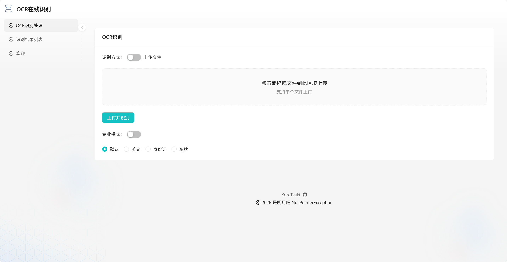

# OCR 项目 :sparkles:

## 📚 项目简介 :sunrise:

本项目是我的毕业设计，一个结合了DDD（领域驱动设计）架构理念的Java-Python跨界之作，旨在提供精准高效的OCR服务。

利用Python的[Paddle OCR](https://github.com/PaddlePaddle/PaddleOCR)库进行文字识别，该库以其高准确率和对复杂场景的适应性著称，能够轻松识别包括180°翻转在内的多种文本形式。

与此同时，Java部分采用了DDD架构，不仅加深了业务理解，也提升了代码的可维护性和扩展性。

前端则选用了Ant Design Pro，为用户提供流畅的交互体验。

- **前端项目地址**：[[ocr-frontend](https://github.com/KoreTsuki/ocr-frontend)] 使用Ant Design Pro构建，为用户带来极致的Web体验。

## 🔄 调用流程与功能说明 :gear:

### 💻 单体版本

- **Python OCR引擎**：图片信息转发至Python后端，调用Paddle OCR进行文字识别。
- **Java处理逻辑**：识别结果被Java后端反序列化，提取关键信息并暂存于Redis（时效5分钟），利用线程池与Redission实现并发控制与流量限制。

## 🎨 功能展示 :framed_picture:

- **截图预览**：

  

- **测试图片**：[示例图片](https://img0.pcauto.com.cn/pcauto/1812/25/14171817_paizhao.jpg)

## 🛠️ 软件架构 :wrench:

遵循DDD原则，项目分为四层：

- **触发层**：http、消息队列、定时任务等
- **应用层**：协调业务逻辑
- **领域层**：核心业务规则与实体
- **基础设施层**：数据库、缓存等

## 🔧 技术栈亮点 :key:

### Java技术栈

| 类别     | 技术/框架   | 用途                            |
| -------- | ----------- | ------------------------------- |
| 基础框架 | Spring Boot | 应用基础框架                    |
| Web框架  | Spring MVC  | 提供HTTP接口                    |
| 数据访问 | MyBatis     | ORM框架，操作数据库             |
| 数据库   | MySQL       | 持久化存储                      |
| 缓存     | Redis       | 临时存储OCR结果、限流，消息队列 |
| 工具库   | OkHttp      | HTTP客户端，调用Python OCR服务  |
| 工具库   | Jackson     | JSON序列化/反序列化             |
| 工具库   | Lombok      | 简化Java代码                    |
| API文档  | Knife4j     | 生成API文档                     |
| 分布式锁 | Redission   | 实现并发控制                    |
| 对象存储 | MinIO       | 存储图片等文件                  |

### Python技术栈

| 类别    | 技术/框架 | 用途                       |
| ------- | --------- | -------------------------- |
| Web框架 | Flask     | 轻量级Web框架，提供OCR接口 |
| OCR库   | PaddleOCR | 核心OCR引擎，实现文字识别  |
| 工具库  | NumPy     | 处理数组等数据结构         |
| 工具库  | JSON      | 处理JSON数据               |

### 前端技术

- **React + Ant Design Pro**：构建现代Web应用

## 📖 安装部署教程 :book:

